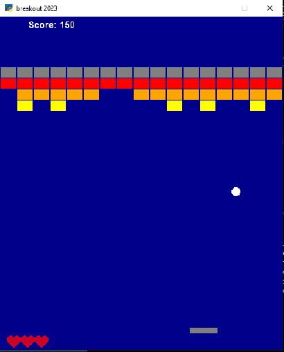

# arcadegame3
## arcadegame-Pong🏓

Language: Python
Module: [arcade](https://api.arcade.academy/)

-------
### Functions
Two rocket:
- one player (The red One)
- one artifical intelligence (The blue One)

-----

## arcadegame-Breakout⚾💥

Language: Python
Module: [arcade](https://api.arcade.academy/)

-----

### Functions and Rules

- rocket motion: with mouse and the right and left keys
- score: each brick, 10 scores
- win: removing all of the bricks
- game over: The player has 3 chances, if the ball goes out, she/he loses one chance. If this happens 3 times, the player is game over.

-----

